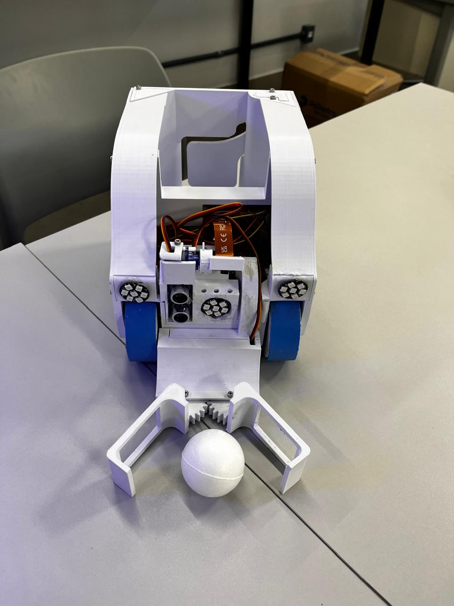
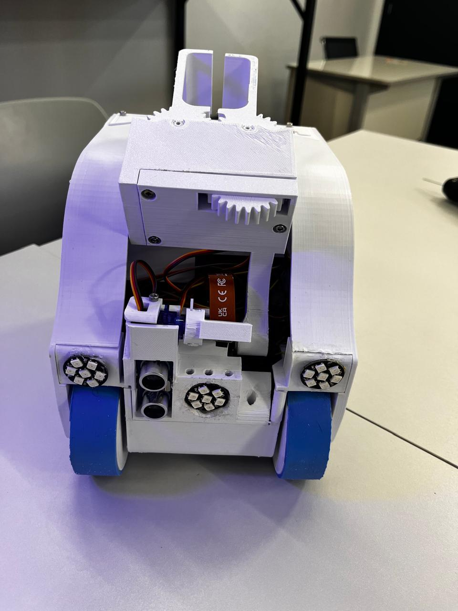
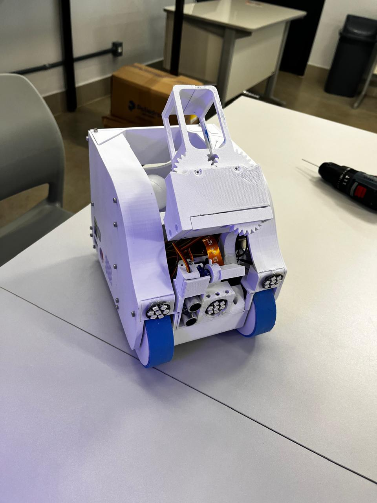
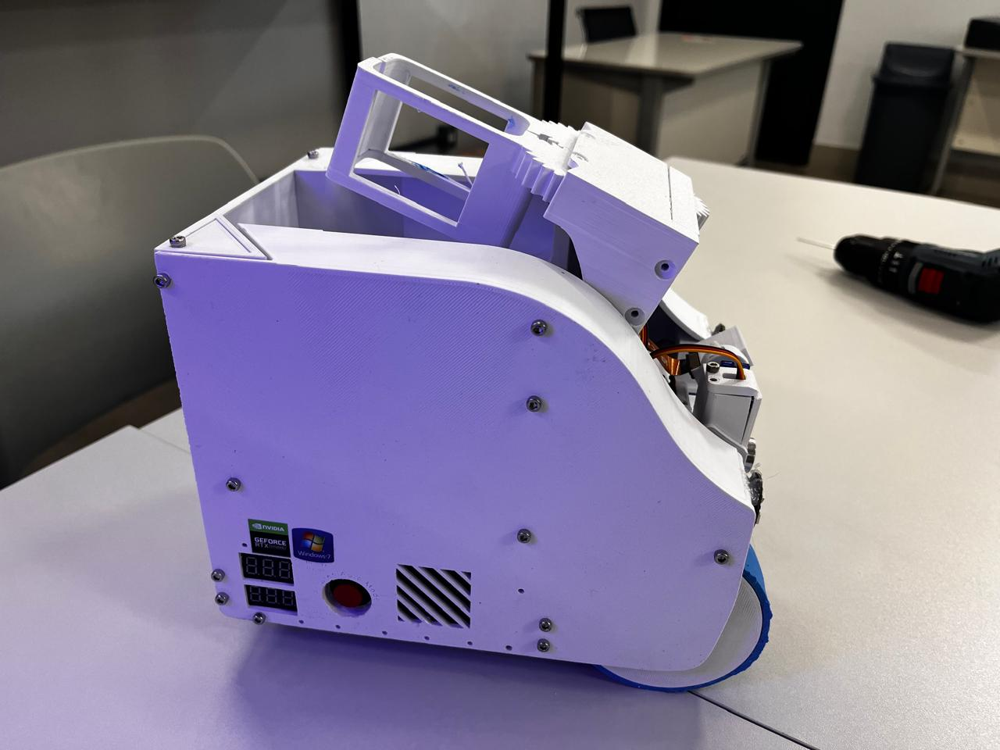

# OBR Mark III — Autonomous Rescue Robot



An autonomous robot built for the **Olimpíada Brasileira de Robótica (OBR) 2025**, Brazil's
national robotics olympiad. It reads green intersection markers, avoids obstacles, collects
rescue balls with a rack-and-pinion gripper, and is tuned live from a browser while it drives.

**It follows the line with computer vision — no infrared sensor array.** Most line-following
robots read the track with a row of IR reflectance sensors a few millimetres above the
ground. This one has a camera and a **Raspberry Pi 5 (4 GB)**, and the line exists only as
pixels. Every steering decision comes out of a real-time OpenCV pipeline running at 480p.

Every structural part was designed in Fusion 360 and 3D printed in PLA. The tyres are custom
silicone, cast in a printed two-part mould, because printed wheels would not hold the track.

---

## What it does

### Finding the line in pixels

The pipeline never thresholds the whole frame looking for a blob. It samples it:

1. **Zero scan.** A horizontal scanline is taken close to the robot and the intensity
   profile along it is differentiated. The line's edges appear as derivative peaks, which
   is robust to uneven lighting in a way that a fixed brightness threshold is not. A
   minimum width of 12 px rejects noise and shadow edges.
2. **Circular scans.** From that first point, the algorithm sweeps arcs of radius 22 px
   through 180° to find where the line continues, then repeats from the new point —
   walking the track forward, several steps ahead of the robot. The traced path is kept in
   a rolling 7-point history.
3. **Steering.** A PID controller acts on the lateral offset of the nearest point, with the
   angle of the traced path fed forward. Because the path is known several points ahead,
   the robot slows into corners rather than discovering them late.

The scan-and-derivative approach is ported from a RoboCup Junior 2014 C++ reference
implementation (`rcj2014_port.py`) and re-derived in Python.

**Optical encoder feedback.** Each wheel reports its own speed, so the controller corrects
for the two motors never being quite identical — the usual reason a differential-drive robot
drifts on a straight line.

**Green intersection markers.** OBR arenas mark junctions with green patches indicating which
branch to take. The vision pipeline segments them in HSV, decides the turn, and executes a
180° reversal when two markers appear at once.

**Rescue-ball retrieval.** A rack-and-pinion gripper driven by an MG996R closes on the ball
and lifts it into an onboard reservoir.

**Camera mounted upside down.** The physical layout forced a 180° camera rotation; the
software rotates every frame before processing rather than fighting it mechanically.

**Thick-line support.** Morphological operations and contour analysis handle track lines up
to 20 mm wide, which break naive centroid-following.

**Live tuning over the network.** A Flask + Socket.IO server streams the robot's own camera
view to a browser and exposes PID gains, HSV thresholds and speed limits as live controls.
Tuning happens while the robot drives, with no reflashing and no reboot.

---

## The parts that were actually hard

### The Raspberry Pi 5 broke every GPIO library

The Pi 5 moved its GPIO behind the RP1 southbridge, and `RPi.GPIO` — the library every
Raspberry Pi robotics tutorial is written against — does not work on it. Nothing we started
from ran.

`hardware_control.py` therefore carries its own **GPIO backend abstraction**: a
`_GPIOBackendBase` interface with pin setup, PWM, and edge-triggered interrupts, implemented
over `lgpio`. Motor control, encoder interrupts and servo PWM all go through it, so the
control code is written once against an interface rather than against whichever library
happens to work on that board revision.

### The LEDs and the motors fought over the same timer

WS2812 addressable LEDs are timing-critical — each bit is a pulse width measured in hundreds
of nanoseconds, and they are usually driven from the Pi's PWM/DMA hardware. The motors need
PWM too. Driving the motors with *software* PWM produced jitter that corrupted the LED
signal; driving the LEDs while software PWM ran produced motor stutter.

The fix is one line of intent in the source — the backend forces **hardware PWM through
lgpio** specifically so the motor channels do not contend with the WS2812 timing. Finding
that took considerably longer than fixing it.

### Cascaded control, not a single PID

There are **three** PID controllers running at 50 Hz:

| Loop | Gains | Job |
|---|---|---|
| Directional (outer) | kp 0.9, kd 0.14 | Turns line error into a steering command |
| Left wheel velocity (inner) | kp 0.25, ki 0.35 | Holds the commanded wheel speed |
| Right wheel velocity (inner) | kp 0.25, ki 0.35 | Same, independently |

The outer loop asks for a turn rate; the inner loops make each wheel actually deliver its
share of it, from optical encoder feedback at 36 ticks per revolution. Without the inner
loops the robot steers correctly and still drifts, because no two DC motors respond
identically to the same duty cycle — the outer loop cannot tell the difference between "the
line moved" and "the left motor is lazy today."

If the encoders fail, the controller detects it and degrades to open loop rather than
stopping.

### Telling a junction apart from a sharp corner

The hardest perception problem in OBR is not finding the line. It is deciding whether the
line suddenly getting wider means *a junction is coming* or *the track turns 90° here* —
because the correct responses are opposite, and getting it wrong ends the run.

`_detect_intersection()` separates them geometrically. It samples the line's width across
the bottom strips and the lateral shift between the bottom and top centroids, then combines
them with the fitted path angle: wide and straight reads as an intersection; a large
centroid shift with a steep angle reads as a 90° curve.

### Nothing is trusted on one frame

Every detector — intersections, 90° curves, green markers — is **debounced over consecutive
frames** before the robot acts on it. A single frame of glare on the track, or one shadow
across a green patch, would otherwise send the robot down the wrong branch at full speed.

Thresholding is adaptive (`ADAPTIVE_THRESH_MEAN_C`, 21 px window) rather than fixed, because
competition lighting varies across the arena and a global threshold that works at one end of
the table fails at the other.

---

## The robot

| | |
|---|---|
|  |  |
| Front — WS2812 indicator rings, ultrasonic sensor, silicone tyres | Reservoir loaded, gripper raised |



Four panel voltmeters report pack and rail voltages at a glance, next to the main power
switch and a printed ventilation grille — useful when you are debugging in a pit between
rounds and need to know the battery state without a laptop.

---

## Architecture

```
src/
├── main.py               State machine — orchestrates behaviour and mode transitions
├── vision.py             Camera pipeline: rotation, thresholding, line and marker detection
├── line_follower.py      PID control, adaptive look-ahead, error computation
├── hardware_control.py   Motor, encoder and servo abstraction over the TB6612FNG drivers
├── web_stream.py         Flask + Socket.IO live video and remote calibration
├── led_control.py        WS2812 status indicators
├── rcj2014_port.py       Scan and error logic ported from the RoboCup Junior 2014 C++ reference
└── index.html            Calibration interface
```

Roughly 1,200 lines of Python across the core modules.

---

## Bill of materials

### Compute and sensing
| Part | Qty |
|---|---|
| Raspberry Pi 5, 4 GB — runs the whole vision pipeline on-board | 1 |
| Picamera3 Wide (mounted inverted) | 1 |
| Ultrasonic distance sensor | 1 |
| Optical encoder speed-sensor modules | 2 |

### Drive
| Part | Qty |
|---|---|
| DC motor, metal reduction gearbox, reversible | 2 |
| TB6612FNG dual H-bridge driver | 2 |
| Hex hub, 12 mm, for 8 mm shaft | 2 |
| Metal caster ball | 1 |
| Silicone tyres, cast in a printed mould | 2 |

### Actuators
| Part | Qty |
|---|---|
| TowerPro MG996R metal-gear servo (gripper) | 1 |
| SG90 9 g micro servo | 3 |
| Circular servo flange | 3 |

### Power
| Part | Qty |
|---|---|
| 18650 Li-Ion cell, 3.7 V (2550 mAh / Samsung 30Q 3000 mAh) | 8 |
| 4-cell 18650 holder, SMT PCB | 2 |
| BMS protection board, 5S 25 A 21 V | 1 |
| BMS protection board, 3S | 1 |
| MP1584 mini DC-DC step-down, 3 A | 5 |
| Mini-560 DC-DC step-down, 5 V | 1 |
| Adjustable current/voltage regulator | 2 |
| 3-digit digital voltmeter | 4 |
| 6A8 rectifier diode, 6 A 800 V | 2 |
| 1000 µF 16 V electrolytic capacitor | 1 |
| 100 pF 50 V ceramic capacitor | 10 |
| R13-507 16 mm momentary switch, 6 A | 1 |
| Dual 18650 charger | 1 |

### Indication and thermal
| Part | Qty |
|---|---|
| WS2812 addressable RGB module, 4-bit | 2 |
| WS2812 addressable RGB module, 7-bit | 1 |
| 40 × 40 × 10 mm fan | 2 |
| Self-adhesive heatsink | 5 |

### Mechanical
| Part | Qty |
|---|---|
| PLA filament — full chassis, gripper, mounts, wheel mould | — |
| M3 × 25 mm Philips screw | 50 |
| M3 nut | 30 |
| M2.5 × 6 mm Philips screw | 50 |
| M3 × 5 × 4.2 heat-set threaded insert | 1 kit |
| 6-way locking connector | 2 |

Threaded brass inserts were heat-set into the printed parts rather than tapping screws
directly into PLA, so the assembly survives repeated disassembly between competition rounds.

---

## CAD

**[`hardware/cad/obr-mark-iii.stl`](hardware/cad/obr-mark-iii.stl) — click to open it in
GitHub's interactive 3D viewer.** Rotate and zoom the assembly in the browser; nothing to
install.

Also committed: `obr-mark-iii.3mf`, print-ready with units and metadata preserved.
67,842 triangles.

### On the tyres

Printed PLA wheels slip on the OBR track surface, especially on inclines. Rather than buy
rubber wheels that would not fit the chassis geometry, we modelled a two-part mould, printed
it, and cast the tyres in silicone. The result grips the track and can be recast in minutes
if one tears mid-competition.

---

## Running it

The modules import each other flatly, and `web_stream.py` serves `index.html` from its own
directory, so run from inside `src/`:

```bash
pip install -r requirements.txt
cd src
python main.py
```

The calibration interface is then at `http://<robot-ip>:5000`.

Hardware-dependent imports (`RPi.GPIO`, `picamera2`, `libcamera`) are guarded, so the vision
and control modules can be exercised on a development machine without the robot attached.

---

## Tests

```bash
pip install -r requirements-dev.txt
pytest -q
```

31 tests over the two modules that decide where the robot goes: the scanline and
derivative line detection in `rcj2014_port.py`, and green-marker detection in `vision.py`.

The cases that matter are the negative ones. A dark speck narrower than the minimum line width
is noise, not the line. A green marker in the top half of the frame is track the robot has not
reached yet. A marker inside the outer 10% of the frame belongs to an adjacent lane. Each of
those filters exists because acting on the wrong one sends the robot down the wrong branch.

Writing them turned up a real bug: `calibrate_by_click` sliced the frame as
`frame_bgr[y, x:x+1]`, which produces a `(1, 3)` array. `cv2.cvtColor` needs `(1, 1, 3)` and
raised every time, and because the exception was caught and logged, click-to-calibrate had
never worked — it just looked like error handling.

## Repository layout

| Path | |
|---|---|
| `src/` | Robot code — the modules above |
| `tests/` | 31 tests over line detection and green-marker detection |
| `hardware/cad/` | Fusion 360 exports: STL and 3MF |
| `hardware/photos/` | Robot photographs |
| `experiments/` | Bring-up scripts kept from development: servo sweeps, LED and SPI tests, encoder checks, earlier vision attempts |
| `docs/` | Wiring and tuning notes |

`experiments/` is deliberately preserved. Getting three servos, an SPI LED strip and two
encoders working reliably took a lot of small scripts, and that iteration is part of the
project.

---

## Built by

Caio Lacerda — [github.com/caioplcerda](https://github.com/caioplcerda) ·
[linkedin.com/in/caio-lacerda](https://linkedin.com/in/caio-lacerda-61b7081b9)
